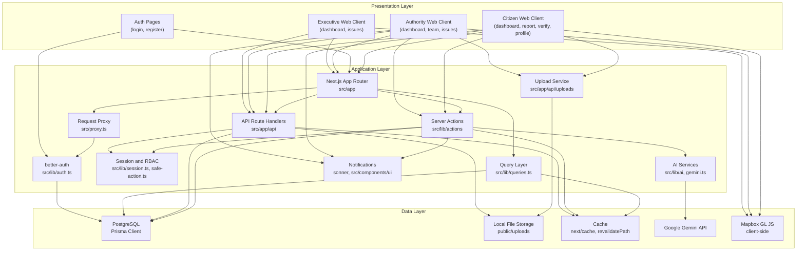

# 03. System Architecture

## 3.1 High-Level Architecture Diagram

## 3.2 Component Interaction & Data Flow

Citizens submit reports through `createReportAction` (`src/lib/actions/reports.ts`). The server queries open issues in the same municipality, applies a 50 m haversine geospatial match (same category), then falls back to Gemini (`analyzeReport`) for category, priority, duplicate detection, and optional root-cause suggestions. Semantic matches ≥ 0.80 within 200 m attach silently; 0.50–0.79 prompt the citizen via `resolveReportDecisionAction`; otherwise a new `Issue` is created. Duplicate attachments increment `reportCount` and may auto-elevate priority (`computeImpact`). On new-issue creation, `detectCascadeWithAI` links causal upstream issues (Gemini with same-category proximity fallback).

New issues start `SUBMITTED`. Citizens verify via `verifyIssueAction`: municipality-scoped, ward-weighted (1.0 same ward / 0.5 same municipality), with optional geotagged proof (EXIF via `/api/uploads/proof`, 200 m radius, ×1.5 weight). Weighted confirm − dispute ≥ 3.0 moves `SUBMITTED` → `VERIFIED`. `LOCAL_BODY_HEAD` can also manually verify via `updateIssueStatusAction`.

Assignment is hierarchical: section heads or `LOCAL_BODY_HEAD` call `requestAssignmentAction` while the issue stays `VERIFIED`; the requested officer accepts via `respondToAssignmentAction` with a `dueDate`, moving to `ASSIGNED`. Officers progress `ASSIGNED` → `IN_PROGRESS` → `RESOLVED` via `updateIssueStatusAction`, posting `IssueUpdate` entries. Resolution opens a separate `RESOLUTION` verification phase; weighted disputes ≥ 3.0 reopen to `REOPENED`.

AI runs synchronously at report submission and new-issue cascade detection. `analyzeRootCauses` exists but is not wired to any route or action. Nepali/English text is handled by Gemini prompts; there is no separate NLP pipeline.

Auth uses better-auth email/password (`/api/auth/[...all]`), 7-day DB sessions. `src/proxy.ts` gates unauthenticated requests; `requireRole` in layouts and `roleActionClient` on mutations enforce RBAC. Municipality scoping applies to authority roles via `scopeForUser` and API handlers. Executive users have national read access only.

Offline sync: **Not yet implemented**. In-app notifications use Sonner toasts (`src/components/ui/sonner.tsx`); SMS is **not yet implemented**. Server mutations invalidate cached routes via `revalidatePath` (`next/cache`). Attention flags compute on page load (`needsAttention`, `src/lib/queries.ts`), not via background workers.
