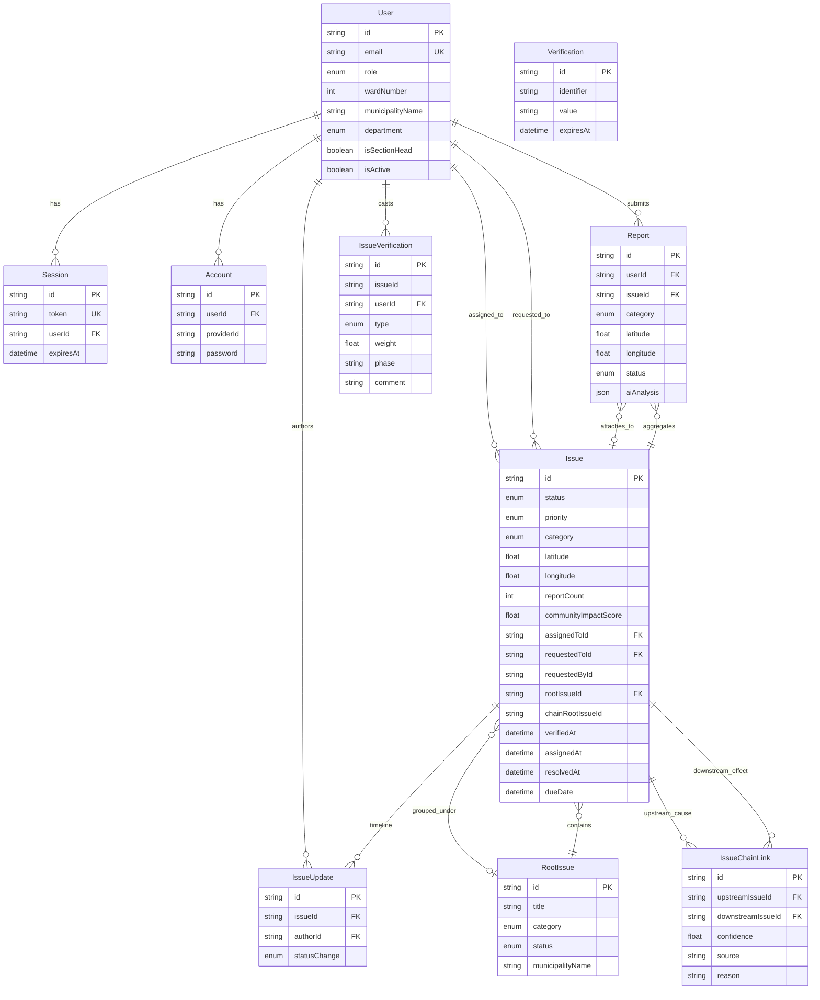

# 04. Database Design

## 4.1 Entity-Relationship Diagram

**Schema notes:** `IssueVerification.issueId` has no Prisma relation or DB foreign key to `issue`. `Issue.requestedById` is stored without a foreign key. `Verification` is the better-auth token table, not civic issue verification.

Source schema: `prisma/schema.prisma`

## 4.2 Table/Collection Descriptions

### User (`user`)

| Field            | Type             | Constraints      | Purpose                                  |
| ---------------- | ---------------- | ---------------- | ---------------------------------------- |
| id               | String           | PK               | better-auth user identifier              |
| name             | String           | NOT NULL         | Display name                             |
| email            | String           | UNIQUE, NOT NULL | Login identifier                         |
| emailVerified    | Boolean          | NOT NULL         | Auth verification flag                   |
| image            | String?          |                  | Avatar URL                               |
| createdAt        | DateTime         | NOT NULL         | Account creation time                    |
| updatedAt        | DateTime         | NOT NULL         | Last profile update                      |
| role             | Role enum        | DEFAULT CITIZEN  | RBAC role                                |
| wardNumber       | Int?             |                  | Citizen ward or employee deployment ward |
| municipalityName | String?          |                  | Jurisdiction scoping                     |
| districtName     | String?          |                  | Administrative tag                       |
| provinceName     | String?          |                  | Administrative tag                       |
| phone            | String?          |                  | Contact number                           |
| department       | Department enum? |                  | Palika section for staff                 |
| isActive         | Boolean          | DEFAULT true     | HEAD can deactivate staff                |
| isSectionHead    | Boolean          | DEFAULT false    | Section head can request assignment      |

### Session (`session`)

| Field     | Type     | Constraints        | Purpose              |
| --------- | -------- | ------------------ | -------------------- |
| id        | String   | PK                 | Session record ID    |
| expiresAt | DateTime | NOT NULL           | Session expiry       |
| token     | String   | UNIQUE, NOT NULL   | Session cookie token |
| createdAt | DateTime | NOT NULL           | Session start        |
| updatedAt | DateTime | NOT NULL           | Session refresh      |
| ipAddress | String?  |                    | Client IP            |
| userAgent | String?  |                    | Client user-agent    |
| userId    | String   | FK → user, CASCADE | Owning user          |

### Account (`account`)

| Field                 | Type      | Constraints        | Purpose              |
| --------------------- | --------- | ------------------ | -------------------- |
| id                    | String    | PK                 | Credential record ID |
| accountId             | String    | NOT NULL           | Provider account ID  |
| providerId            | String    | NOT NULL           | Auth provider        |
| userId                | String    | FK → user, CASCADE | Owning user          |
| accessToken           | String?   |                    | OAuth access token   |
| refreshToken          | String?   |                    | OAuth refresh token  |
| idToken               | String?   |                    | OIDC ID token        |
| accessTokenExpiresAt  | DateTime? |                    | Token expiry         |
| refreshTokenExpiresAt | DateTime? |                    | Refresh expiry       |
| scope                 | String?   |                    | OAuth scopes         |
| password              | String?   |                    | Hashed password      |
| createdAt             | DateTime  | NOT NULL           | Record creation      |
| updatedAt             | DateTime  | NOT NULL           | Record update        |

### Verification (`verification`)

| Field      | Type      | Constraints | Purpose             |
| ---------- | --------- | ----------- | ------------------- |
| id         | String    | PK          | Token record ID     |
| identifier | String    | NOT NULL    | Email or identifier |
| value      | String    | NOT NULL    | Verification code   |
| expiresAt  | DateTime  | NOT NULL    | Token expiry        |
| createdAt  | DateTime? |             | Creation time       |
| updatedAt  | DateTime? |             | Update time         |

### Report (`report`)

| Field            | Type              | Constraints          | Purpose                       |
| ---------------- | ----------------- | -------------------- | ----------------------------- |
| id               | String            | PK, cuid             | Individual citizen submission |
| title            | String            | NOT NULL             | Report headline               |
| description      | String            | NOT NULL             | Full report text              |
| category         | Category enum     | NOT NULL             | Issue category                |
| latitude         | Float             | NOT NULL             | Geo location                  |
| longitude        | Float             | NOT NULL             | Geo location                  |
| address          | String?           |                      | Human-readable address        |
| wardNumber       | Int?              |                      | Ward at submission            |
| municipalityName | String?           |                      | Municipality                  |
| districtName     | String?           |                      | District                      |
| provinceName     | String?           |                      | Province                      |
| images           | String[]          |                      | Uploaded image URLs           |
| userId           | String            | FK → user            | Submitting citizen            |
| issueId          | String?           | FK → issue, SET NULL | Parent issue when attached    |
| aiAnalysis       | Json?             |                      | Gemini analysis snapshot      |
| status           | ReportStatus enum | DEFAULT PENDING      | PENDING, ATTACHED, PROMOTED   |
| createdAt        | DateTime          | DEFAULT now()        | Submission time               |

### Issue (`issue`)

| Field                 | Type             | Constraints               | Purpose                      |
| --------------------- | ---------------- | ------------------------- | ---------------------------- |
| id                    | String           | PK, cuid                  | Aggregated public issue      |
| title                 | String           | NOT NULL                  | Issue headline               |
| description           | String           | NOT NULL                  | Issue description            |
| category              | Category enum    | NOT NULL                  | Owning department mapping    |
| status                | IssueStatus enum | DEFAULT SUBMITTED         | Lifecycle state              |
| priority              | Priority enum    | DEFAULT MEDIUM            | AI + arithmetic priority     |
| latitude              | Float            | NOT NULL                  | Issue location               |
| longitude             | Float            | NOT NULL                  | Issue location               |
| address               | String?          |                           | Human-readable address       |
| wardNumber            | Int?             |                           | Ward                         |
| municipalityName      | String?          |                           | Municipality scope           |
| districtName          | String?          |                           | District                     |
| provinceName          | String?          |                           | Province                     |
| confirmCount          | Int              | DEFAULT 0                 | Raw existence confirm count  |
| disputeCount          | Int              | DEFAULT 0                 | Raw existence dispute count  |
| reportCount           | Int              | DEFAULT 1                 | Clustered report count       |
| communityImpactScore  | Float            | DEFAULT 0.3               | Impact score 0.0–1.0         |
| affectedCitizenCount  | Int              | DEFAULT 1                 | Display alias of reportCount |
| assignedToId          | String?          | FK → user, SET NULL       | Responsible officer          |
| requestedToId         | String?          | FK → user, SET NULL       | Pending assignment target    |
| requestedById         | String?          |                           | Requesting head (no FK)      |
| requestedAt           | DateTime?        |                           | Assignment request time      |
| rootIssueId           | String?          | FK → root_issue, SET NULL | Systemic grouping            |
| chainRootIssueId      | String?          |                           | Top of causal chain          |
| aiRootCauseSuggestion | String?          |                           | AI root cause title          |
| aiRootCauseReason     | String?          |                           | AI explanation               |
| aiRootCauseConfidence | Float?           |                           | Internal threshold score     |
| aiRootCauseRelatedIds | String[]         |                           | Related issue IDs            |
| escalatedAt           | DateTime?        |                           | Escalation timestamp         |
| dueDate               | DateTime?        |                           | Officer commitment date      |
| verifiedAt            | DateTime?        |                           | Verified phase timestamp     |
| assignedAt            | DateTime?        |                           | Assigned phase timestamp     |
| resolvedAt            | DateTime?        |                           | Resolved phase timestamp     |
| createdAt             | DateTime         | DEFAULT now()             | First report time            |
| updatedAt             | DateTime         | AUTO                      | Last mutation                |

### IssueVerification (`issue_verification`)

| Field       | Type                  | Constraints       | Purpose                     |
| ----------- | --------------------- | ----------------- | --------------------------- |
| id          | String                | PK, cuid          | Verification vote ID        |
| issueId     | String                | NOT NULL          | Target issue (no DB FK)     |
| userId      | String                | FK → user         | Verifying citizen           |
| type        | VerificationType enum | DEFAULT CONFIRM   | CONFIRM or DISPUTE          |
| weight      | Float                 | DEFAULT 1         | Locality × proof multiplier |
| isLocal     | Boolean               | DEFAULT false     | Verifier in issue ward      |
| proofImages | String[]              |                   | Geotagged proof URLs        |
| phase       | String                | DEFAULT EXISTENCE | EXISTENCE or RESOLUTION     |
| comment     | String?               |                   | Optional public reason      |
| createdAt   | DateTime              | DEFAULT now()     | Vote time                   |

Unique: `(issueId, userId, phase)`.

### IssueUpdate (`issue_update`)

| Field        | Type         | Constraints   | Purpose           |
| ------------ | ------------ | ------------- | ----------------- |
| id           | String       | PK, cuid      | Timeline entry ID |
| issueId      | String       | FK → issue    | Parent issue      |
| authorId     | String       | FK → user     | Author            |
| content      | String       | NOT NULL      | Update text       |
| images       | String[]     |               | Evidence photos   |
| statusChange | IssueStatus? |               | Status transition |
| createdAt    | DateTime     | DEFAULT now() | Entry time        |

### RootIssue (`root_issue`)

| Field            | Type                 | Constraints    | Purpose                |
| ---------------- | -------------------- | -------------- | ---------------------- |
| id               | String               | PK, cuid       | Systemic root issue ID |
| title            | String               | NOT NULL       | Root cause title       |
| description      | String               | NOT NULL       | Root cause description |
| category         | Category enum        | NOT NULL       | Category               |
| status           | RootIssueStatus enum | DEFAULT ACTIVE | ACTIVE or RESOLVED     |
| municipalityName | String?              |                | Municipality scope     |
| districtName     | String?              |                | District               |
| provinceName     | String?              |                | Province               |
| createdAt        | DateTime             | DEFAULT now()  | Creation time          |
| updatedAt        | DateTime             | AUTO           | Last update            |

### IssueChainLink (`issue_chain_link`)

| Field             | Type     | Constraints   | Purpose                |
| ----------------- | -------- | ------------- | ---------------------- |
| id                | String   | PK, cuid      | Link record ID         |
| upstreamIssueId   | String   | FK → issue    | Cause issue            |
| downstreamIssueId | String   | FK → issue    | Effect issue           |
| detectedAt        | DateTime | DEFAULT now() | Detection time         |
| confidence        | Float    | DEFAULT 0.7   | Internal AI/rule score |
| reason            | String?  |               | Causal explanation     |
| source            | String   | DEFAULT ai    | ai or rule             |

Unique: `(upstreamIssueId, downstreamIssueId)`.

## 4.3 Indexing Strategy & Query Optimization

**Existing indexes:** `user.email` (unique), `session.token` (unique), `issue_verification(issueId, userId, phase)` (unique), `issue_chain_link(upstreamIssueId, downstreamIssueId)` (unique). No btree indexes on `issue.status`, `issue.municipalityName`, `issue.wardNumber`, `issue.category`, `issue.assignedToId`, or `report.userId`.

**Recommended composites** for current query patterns: `(municipalityName, status, category, createdAt DESC)` for clustering and list views; `(assignedToId, status)` for officer queues; `(municipalityName, status, wardNumber)` for citizen/authority feeds.

**Geospatial:** `latitude`/`longitude` floats with no PostGIS or spatial index. Radius queries fetch up to 500 rows and filter via haversine in JavaScript. Production would need PostGIS + GiST or bounding-box pre-filters.

**Denormalization:** `confirmCount`, `disputeCount`, `reportCount`, `communityImpactScore`, `affectedCitizenCount`, and phase timestamps avoid hot-path aggregations.

**Pagination and caching:** `/api/issues` uses offset pagination; no Redis or cache layer. Dashboard stats recompute on each page load. **Not yet implemented:** read-through cache, materialized views, cursor pagination.
